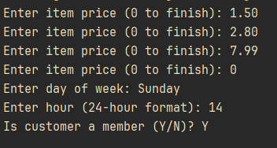
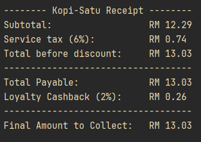
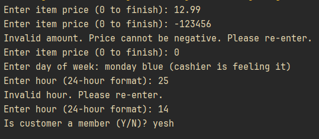

### Problem description
The café owner wants to transition from conventional handwritten receipts to a smart digital billing system. The new system should automatically calculate the total bill for each customer by handling sorts of pricing scenarios, applying conditional taxes, and offering special discounts or cashback bonuses based on specific conditions.

The main objective of the system is to ensure accuracy and speed during billing by allowing the cashier to input multiple item prices, validate entries, compute service tax, and apply the correct discounts according to the day of the week and time of purchase. Additionally, loyal customers who are members should receive a cashback reward. Finally, the system should display a detailed receipt that summarizes the subtotal, tax, discounts, cashback and, the final amount to be collected.

### Solution Explanation
The program starts by collecting inputs from the cashier, the inputs are as following:
- Price of item(s)
- Day of week
- Hour of time
- Whether the customer is a member

Each input call is put into a `while` loop, the loop breaks only if the input is valid; if the input is invalid, the loop continues and the cashier will be reprompted until a valid input is readed. This serves as simple data validation.
The validation rules are as follows:

- Price of items(s)
    - A postiive double value as the price of single item
    - A negative double value will be deemed invalid and is discarded
    - Zero to mark the end of input
- Day of week
    - A string
    - The input will be then converted to lowercase and only the first three characters will be extracted for use. This makes the input process easier and more intuitive (example: user can enter either Sunday, sunday, or sun)
    - Only these inputs (after processing) are accepted: sun, mon, tue, wed, thu, fri, and sat
- Hour of time
    - A positive integer within the range 0 to 24, inclusively
- Membership status
    - String, first character extracted and converted to char
    - Accepts 'y' or 'n' only
    - Determines value of isMember (boolean)

After inputs comes calculation.
Calculations are done simultaneously with printing parts/lines of receipts.

Calculations consist of mainly these parts:
- Service tax calculations
    - 6% for subtotal <= RM30
    - 8% for RM30 < subtotal <= RM100
    - 10% for subtotal > RM100
- Discounts
    - Weekday discounts
        - Student Saver Discounts -10% only if the subtotal > RM 25
        - Happy Hour Discounts -5% only if 15 <= hour of time < 17
    - Weekend discounts
        - Weekend Combo Discounts -5% only if subtotal >= RM50
- Loyalty Cashbacks
    - Apply 2% cashback only if customer is a member

About printing the receipt: Number of whitespaces are calculated manually and whitespaces are hardcoded, while the price amount is done through conversion specifier `%-4.2f`, which translates to minimum of four characters length, including two decimal points, and left justified.

### Sample input and output
Sample 1

Sample 2

### Source code
See [Q2.java](Q2.java)
